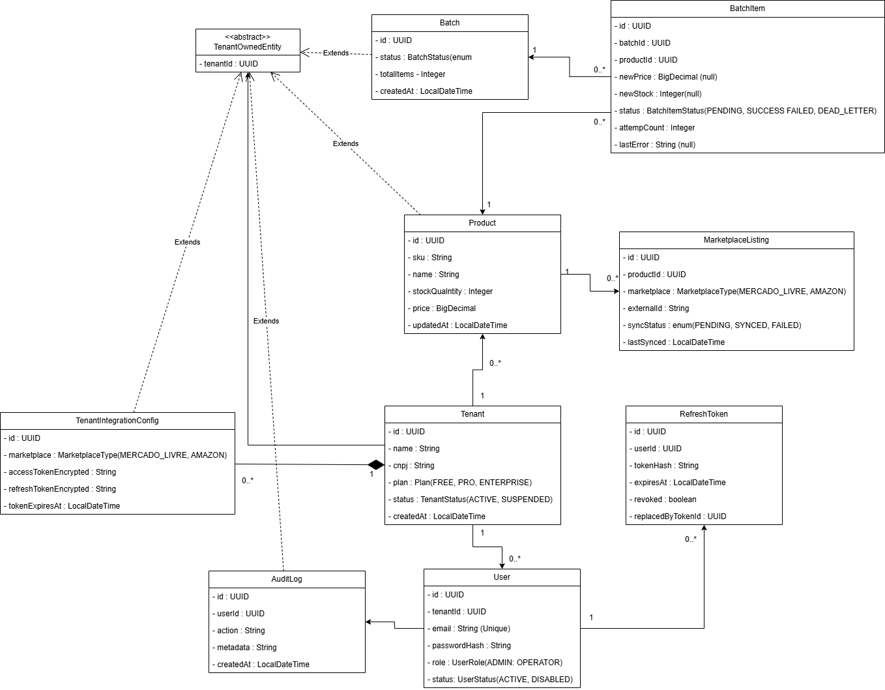
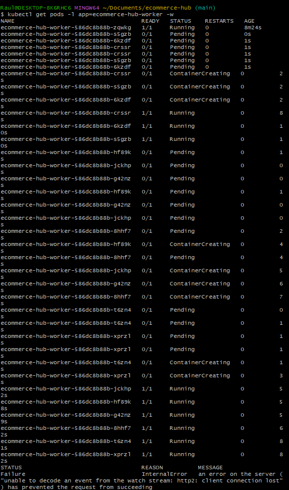
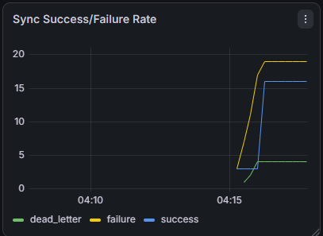
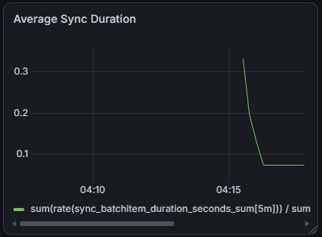
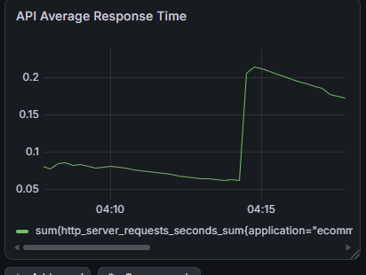

# E-commerce Hub


A multi-tenant SaaS platform that synchronizes inventory and pricing between merchant catalogs and marketplaces (Mercado Livre, Amazon) — asynchronously, resiliently, and with proof it survives real load.


> This is a portfolio/demonstration project. It's built to prove specific distributed-systems concepts under real, observable conditions — not to be a one-command deploy. See ["Running it locally"](#running-it-locally) for the reduced-scope setup that actually applies.

---

## The problem

A merchant selling on their own storefront, Mercado Livre, and Amazon shares one inventory pool across all three channels. If one unit sells on Amazon, the other channels need to know within seconds — otherwise the same item gets sold twice ("oversell"). During peak events like Black Friday, a merchant may need to push 10,000 price updates at once without taking the system down.

E-commerce Hub solves this by decoupling the fast path (receiving updates) from the slow path (calling flaky external marketplace APIs), with full tenant isolation so one merchant's data is never visible to another — on the same database, same API, same cluster.

---

## Architecture


A batch upload returns `202 Accepted` immediately — the caller never waits for marketplace calls to complete. Each `BatchItem` moves through `PENDING → SUCCESS | FAILED → DEAD_LETTER`, tracked independently. Both API and Worker run as Kubernetes Deployments; the Worker autoscales via KEDA based on queue depth, not CPU/memory.



The diagram illustrates one of the project's key architectural decisions: how tenant isolation is enforced across the data model.

TenantOwnedEntity is an abstract base class containing a single tenantId field. User, Product, Batch, AuditLog, and TenantIntegrationConfig inherit from it. Entities extending this class are automatically subject to Hibernate's tenant isolation filter, eliminating the need to manually add WHERE tenant_id = ? to every query.

Not every entity inherits from TenantOwnedEntity, and this is intentional:

Tenant does not inherit from it because it represents the tenant itself, rather than data owned by a tenant.
RefreshToken is scoped through userId. Since each user already belongs to a tenant, tenant isolation is enforced indirectly through the user relationship.
BatchItem and MarketplaceListing are scoped through their parent entities (Batch and Product, respectively). Storing a separate tenantId would therefore be redundant.

The composition relationship between Tenant and TenantIntegrationConfig also reflects the domain model: an integration configuration belongs to a tenant and does not have an independent lifecycle.

This approach makes tenant isolation explicit at the data-model level, reducing the risk of accidental cross-tenant data access while keeping the implementation consistent across the application.

Why this matters: the multi-tenant architecture was designed entity by entity, based on ownership and relationships, rather than applying a generic tenantId field indiscriminately across the entire model.

---

## The proof

Talk is cheap — this section is the evidence, not the pitch.

### Autoscaling under real load (KEDA)

The Worker scales from 1 to 10 replicas in response to actual RabbitMQ queue depth — not CPU/memory, the default Kubernetes metric, which wouldn't reflect backlog on an I/O-bound consumer like this one.


*`kubectl get pods -l app=ecommerce-hub-worker -w` — new pods spinning up in real time (`Pending → ContainerCreating → Running`) as KEDA scales the Worker from 1 to 10 replicas in response to real RabbitMQ backlog.*

### Tests run against real infrastructure, on every push

No mocked databases in integration tests — Testcontainers spins up real MySQL instances. The pipeline fails the build if any of it breaks.


*Both pipeline jobs green: test suite (Testcontainers-backed) and Docker image build/publish to GHCR.*

### Observability under load


*16 items were successfully synchronized, while 4 were sent to the Dead Letter Queue after exhausting all retry attempts. Despite the failures, the remaining processing continued normally without bringing the system to a halt.*


*The increase in average processing time clearly shows when the exponential backoff retries and Circuit Breaker came into action during marketplace failures.*


*The dashboard also automatically monitors API endpoint latency through Spring Boot Actuator. For example, it is possible to identify the higher response time of the authentication endpoint due to the use of Argon2id.*

---

## Stack — and why

| Technology | Why |
|---|---|
| **Java 21 + Spring Boot 4.1** | LTS baseline, Virtual Threads, mature enterprise ecosystem |
| **MySQL 8** | ACID guarantees for inventory data — silent lost updates aren't acceptable here |
| **RabbitMQ** | Decouples the fast HTTP path from slow external calls; built-in DLQ support without extra setup (vs. Kafka, which fits event streaming/replay use cases this project doesn't need) |
| **Redis** | Caches marketplace credentials per tenant — without it, every queued message would hit MySQL for a token lookup |
| **Flyway** | Schema changes only happen through versioned, reviewable migrations — never auto-generated `ddl-auto` |
| **Resilience4j** | Circuit breaker isolated in its own bean (`MarketplaceSyncExecutor`) so retry/backoff logic stays testable independent of message consumption |
| **nimbus-jose-jwt** | Full control over accepted algorithms — explicitly rejects `alg: none` and unexpected algorithms, a common JWT attack vector |
| **Argon2id** | Memory-hard password hashing, resistant to GPU/ASIC attacks (chosen over bcrypt for that reason) |
| **Kubernetes + KEDA** | Worker autoscales on RabbitMQ queue depth via the RabbitMQ management HTTP API (not raw AMQP polling — more resilient to the kind of local-network flakiness a Docker Desktop bridge can produce) |
| **Prometheus + Grafana** | Metrics-based proof the system holds up under load, not just a claim |
| **GitHub Actions** | Every push is tested (Testcontainers-backed integration tests) before an image is published |

Multi-tenancy is enforced via a Hibernate filter activated per-request from the validated JWT — application code never has to remember to add `WHERE tenant_id = ?` manually.

---

## Running it locally

This covers local development only — API and Worker running outside Docker, talking to containerized infrastructure. It does **not** cover the Kubernetes/KEDA/Helm setup used to produce the autoscaling evidence above; that stack exists to demonstrate the concept, not to be spun up casually.

```bash
docker compose up -d          # MySQL, RabbitMQ, Redis, WireMock, Prometheus, Grafana
./mvnw clean install -DskipTests
./mvnw spring-boot:run -pl ecommerce-hub-api      # in one terminal
./mvnw spring-boot:run -pl ecommerce-hub-worker   # in another
```

API: `http://localhost:8080` · RabbitMQ management: `http://localhost:15672` (guest/guest) · Grafana: `http://localhost:3000`

Requires a `.env` file (see `.env.example`) with `JWT_SECRET`, `DISCORD_WEBHOOK_URL`, and database credentials.

---

## Contact

**Raul Guilherme** — [LinkedIn](https://www.linkedin.com/in/raul-guilherme-bezerra-da-silva-/) · [GitHub](https://github.com/Raul-guii) · [Email](raulawp460@gmail.com)


